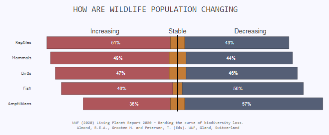

# Data Visualization Portfolio

## Table of contents
* [Introduction](#introduction)
* [Visualization](#usage)

## Introduction
This repository serves as a comprehensive collection of my diverse projects focusing on data visualization. Leveraging the power of Dash for creating interactive dashboards and Plotly as the visualization tool, these projects demonstrate the art of transforming complex data into compelling visual representations. From dynamic charts to interactive maps, each project showcases the potential of data visualization in conveying insights effectively. 

## Visualization

Can Find all Visuals [Here](https://data-visualization.up.railway.app/)

### Generation Population

Medium Post [Link](https://abhinavk910.medium.com/data-visualization-with-plotly-ea7f8788b2df)

Visualization [Link](https://data-visualization.up.railway.app/apps/us_population)

### WildLife Population changing

Medium Post [Link](https://abhinavk910.medium.com/spine-plot-in-plotly-d74f1c6bf599)

### How Popular your's Birthday

Medium Post [Link](https://abhinavk910.medium.com/data-visualization-with-plotly-waffle-chart-and-hover-customization-cccdcf7c8be)

### WordCloud from Website

[Link](https://data-visualization.up.railway.app/apps/wordcloud)

### National Family Health Survey (NFHS-5) 2019-21

[Link](https://data-visualization.up.railway.app/apps/nfhs5)

### India Refinery Dashboard

[Link](https://data-visualization.up.railway.app/apps/indian_refinery)

### Gender Pay Gap

[Link](https://data-visualization.up.railway.app/apps/gender_pay_gap)

### Abortion in USA

[Link](https://data-visualization.up.railway.app/apps/usa_abortion)

### Entry Level Job

[Link](https://data-visualization.up.railway.app/apps/uk_entry_level_job_exp)

### US President Election

[Link](https://data-visualization.up.railway.app/apps/usa_what_if_votes)

### Stop and Search

[Link](https://data-visualization.up.railway.app/apps/sands_uk)

### University Loan

[Link](https://data-visualization.up.railway.app/apps/usa_uni_loan)

### Plastic Waste Matter Index

[Link](https://data-visualization.up.railway.app/apps/sup_contributor)

### Web Anlytic Dashboard

[Link](https://data-visualization.up.railway.app/apps/website_analytic)

### Sports Viz LACROSSE

[Link](https://data-visualization.up.railway.app/apps/sports_viz_sunday_lacrosse)
